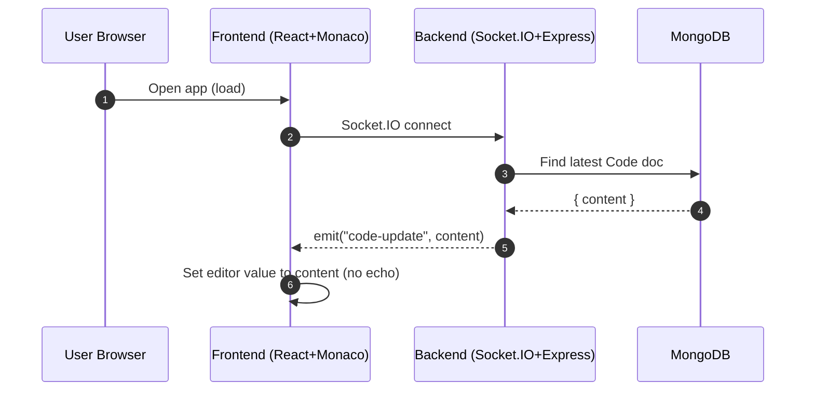
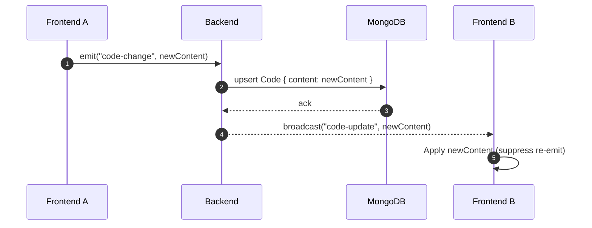
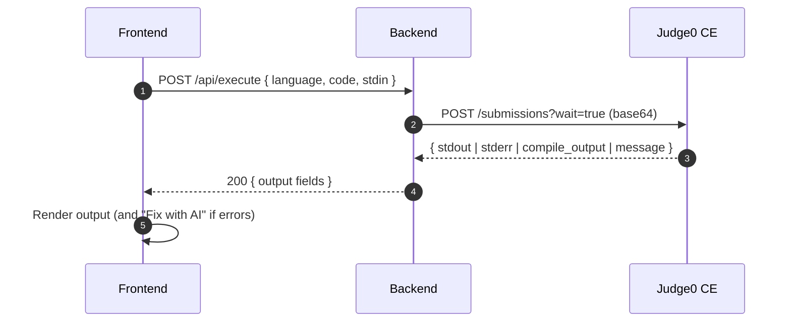
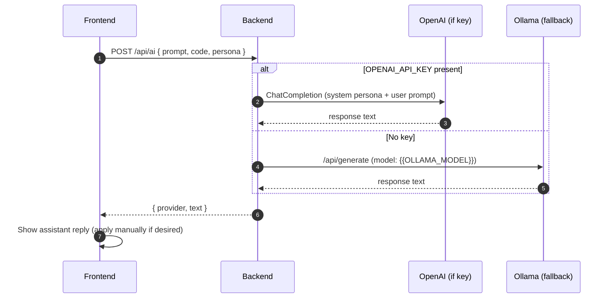
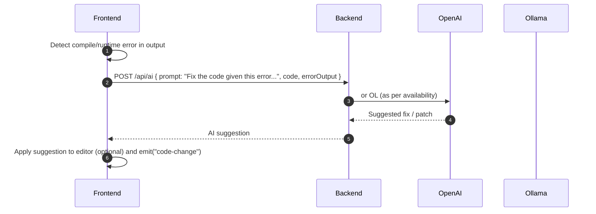

# CodePulse — Flow Diagrams

These Mermaid diagrams illustrate how the app works end-to-end: architecture, real-time sync, code execution via Judge0, and AI features (assistant and inline completion).

Tip: In VS Code, open this file and press Ctrl+Shift+V to preview. If Mermaid doesn’t render, install a Mermaid preview extension.

## Architecture overview

```mermaid
graph LR
  U[User] -->|Edits Code / Clicks Run| FE[Frontend (React + Monaco)]
  subgraph Browser
    FE
  end

  FE -- Socket.IO (WebSocket) --> BE[Backend (Express + Socket.IO)]
  FE -- REST (HTTP) --> BE

  subgraph Server
    BE
    DB[(MongoDB Atlas)]
  end

  BE <--> DB

  BE -- REST (HTTPS) --> J0[[Judge0 CE API]]

  BE -- OpenAI (if key) --> OA[(OpenAI API)]
  BE -- Ollama (fallback) --> OL[(Ollama Local Model)]

  classDef svc fill:#eef,stroke:#99f,stroke-width:1px;
  classDef ext fill:#ffe,stroke:#cc3,stroke-width:1px;
  class FE,BE,DB svc;
  class J0,OA,OL ext;
```

## Initial load and sync



## Real-time editing (autosave + broadcast)



## Run code (Judge0 execution)



## Ask AI (Explain/Improve/Refactor/Tests/Docs)



## Inline Suggest (tab-complete)

```mermaid
sequenceDiagram
  autonumber
  participant FE as Frontend
  participant BE as Backend
  participant OA as OpenAI (if key)
  participant OL as Ollama (fallback)

  FE->>BE: POST /api/ai/complete { code, cursorOffset }
  alt OPENAI_API_KEY present
    BE->>OA: Prompt for short next-token completion
    OA-->>BE: completion snippet
  else No key
    BE->>OL: /api/generate (short completion)
    OL-->>BE: completion snippet
  end
  BE-->>FE: { provider, completion }
  FE->>FE: Insert at cursor; emit("code-change")
```

## Fix with AI (from failed run)



---

Notes
- The backend uses Mongoose to upsert a single shared Code document for simplicity.
- Socket events: code-change (from editor) and code-update (from server to all others).
- Judge0 is the CE instance at https://ce.judge0.com with wait=true for synchronous results.
- AI provider selection is dynamic: OpenAI if OPENAI_API_KEY is set; otherwise Ollama at OLLAMA_URL with model OLLAMA_MODEL.
